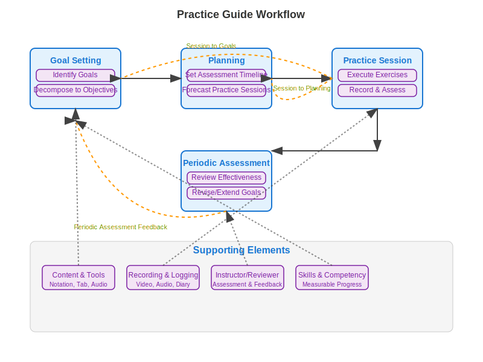

# Workflows

The application covers a wide range of functionality as specified in [Functionality](./functionality.md)
and [Requirements](./requirements.md), so this article will cover the workflows.

## Goal Setting

Before a practitioner can set up a plan, they need goals to set a vision and path
for what skills they need to cultivate.

Goal setting is the identification of one or more goals.

But the process requires that the practitioner has a set of goals that can
lead to specific actionable steps to build the exact skills necessary
to achieve each of the goals.

For that reason, there may be multiple "levels" of goals.

For example a goal like "I want to be able to play the Blues" is a bit ambiguous,
but may be decomposed into something like:

1.  I want to be able to play the bassline of "Pride and Joe" by SRV,
    and perhaps other blues oriented songs.

2.  I want to be able to improvise over a basic 12 bar blues pattern.

Each of the goals can be decomposed into smaller chunked goals,
and ultimately specific objectives.

### Goals vs. Objectives

The terms "Goal" and "Objective" can be used interchangably in a general context.

In context of practice, we'll use the term "Goal" to mean a broader outcome related to performance.

"Objective" will be used to mean a very granular outcome that is tied to building competency in one or more related skills, that can be practiced through either hands-on exercises or academic learning (i.e. theory).
Typically multiple objectives are tied to success meeting one or more goals.

In the example of goals above, some objectives for goal #1 might be:

- Study of 12 Bars Blues pattern and shuffle
- Ability to play 8th notes and triplets ~120 tempo 4/4 time

Must of the objectives can probably be achieved using notation/tab for the track
including playback.

Sometimes it may not be apparent to the practitioner what skills they will
need to play the song, this is where an instructor can help assess
where the student is at, and what skills they need to work on to achieve their
goals.

## Planning

Once the practitioner has a list of goals and objectives (what skills they need),
they need to factor that into the practice time,
but in a way that allow modification to objectives and goals at any time.

Planning is done at two levels:

- Next assessment for the goals

- Practice sessions that are forecasted up to the next assessment event

### Session forecasting

Practice sessions are forecasted with a list of objectives and associated exercises.

## Practice Session

### Exercises

Each exercise has one or more practice assets, in the form of content or tools.
The session should start with a warmup exercise.

### Post session assessment

At the end of the practice session,
the practitioner should assess how each of the exercises went,
and logged against the practice session.
The assessment should be as objective as possible:
Did the practitioner successfully improve their "baseline", no improvement, get worse?

If over the course of several sessions there is no improvement,
may indicate need to revisit/adjust objectives or goals.

### Recording

Ideally the practitioner should record each of the exercises,
or at least the session in its entirety.
This allow instructor or peer review to assist with an assessment.

### Log it

All practice sessions will be logged in a "diary" associated with the practitioner,
with assessments as part of each exercise.

## Periodic Assessment

At the end of the designated goal period,
the practitioner must assess (optionally with aid of instructor or peer reviewer)
the effectiveness of the practice sessions within the period.

This may include a performance based assessment to verify effectiveness
of achieving the goal.  A recording may be used for instructors and/or peer reviewers
feedback.

The goal may be either extended or revised if the goal is not achieved.

## Overview

